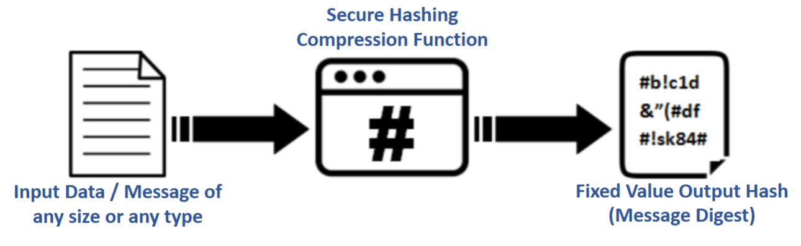
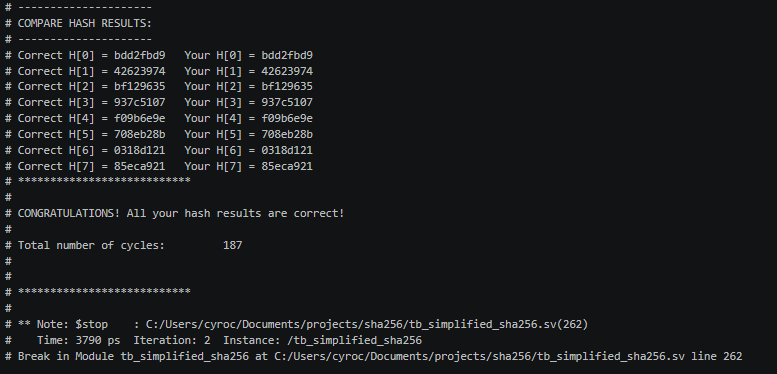
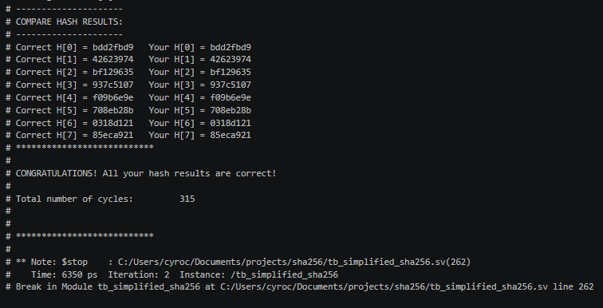

# Synthesizable SHA-256 Implementation

  

This RTL model implements the SHA-256 hashing algorithm, which efficiently generates a **256-bit hash** for input data of **any size**. To determine the efficiency of the design I considered the FPGA resources consumed, maximum clock frequency, and total cycles used to complete the hashing process. Using these, I was able to keep track of **Area** and **Delay** parameters for each iteration of my design.

    Area: ALUTs + Total Registers
    Delay: Cycles / Fmax

`Delay` represents how long one computation takes, while `Area` defines how many resources are required to implement the design on an FPGA. The final measure of efficiency is described by **Area*Delay** as it reflects both speed and size constraints.

---

## Results
The data used to evaluate the efficiency of my design was generated by the Synthesis Compiler (Quartus Prime). All relevant information is available in the `output_files` folder. This design was synthesized for implementation on the Arria II GX EP2AGX45DF29I5 FPGA using Slow 900mV 100C Mod for timing analysis.

### First Iteration
In the first working version of the SHA-256, I constructed a straightforward approach that performs an entire SHA-256 hash round in a single cycle.

    Logic utilization : 9 %
        Combinational ALUTs : 1,776 / 36,100 ( 5 % )
        Memory ALUTs : 0 / 18,050 ( 0 % )
        Dedicated logic registers : 2,143 / 36,100 ( 6 % )
    Total registers : 2143

    +--------------------------------------------------+
    ; Slow 900mV 100C Model Fmax Summary               ;
    +------------+-----------------+------------+------+
    ; Fmax       ; Restricted Fmax ; Clock Name ; Note ;
    +------------+-----------------+------------+------+
    ; 152.74 MHz ; 152.74 MHz      ; clk        ;      ;
    +------------+-----------------+------------+------+

  

### Pipelined Implementation
In an attempt to improve the throughput of my design, I pipelined the SHA-256 operation to be completed over 2 cycles. This required more registers to move relevant data through the pipeline, but improved Fmax drastically as a result of the reduced critical path.

    Logic utilization : 9 %
        Combinational ALUTs : 1,799 / 36,100 ( 5 % )
        Memory ALUTs : 0 / 18,050 ( 0 % )
        Dedicated logic registers : 2,528 / 36,100 ( 7 % )
    Total registers : 2528

    +-------------------------------------------------+
    ; Slow 900mV 100C Model Fmax Summary              ;
    +-----------+-----------------+------------+------+
    ; Fmax      ; Restricted Fmax ; Clock Name ; Note ;
    +-----------+-----------------+------------+------+
    ; 206.4 MHz ; 206.4 MHz       ; clk        ;      ;
    +-----------+-----------------+------------+------+

  

---

## Efficiency Evaluation
First let us look at the **pipelined implementation**

    Area:         4327
    Delay:        1.54 microseconds

    Area * Delay: 6.66 (ms*area)

Next consider the **original implementation**:

    Area:         3919
    Delay:        1.44 microseconds

    Area * Delay: 5.46 (ms*area)

  By attempting to optimize my design using pipelining I found that, although Fmax increased, it didn't increase enough to justify the extra cycles and FPGA resources consumed. As we can see from the data, both area and delay decrease when pipelining is introduced.

